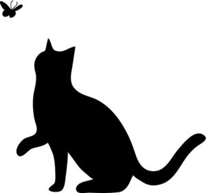
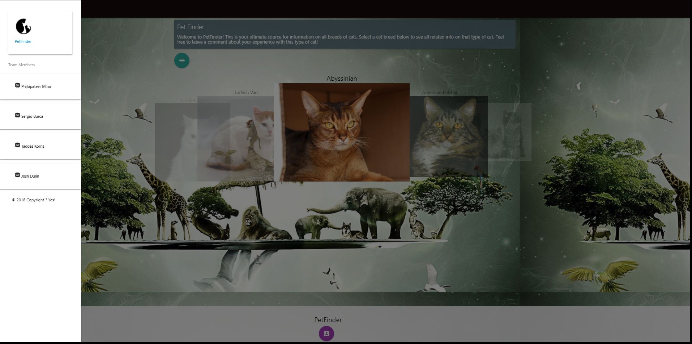
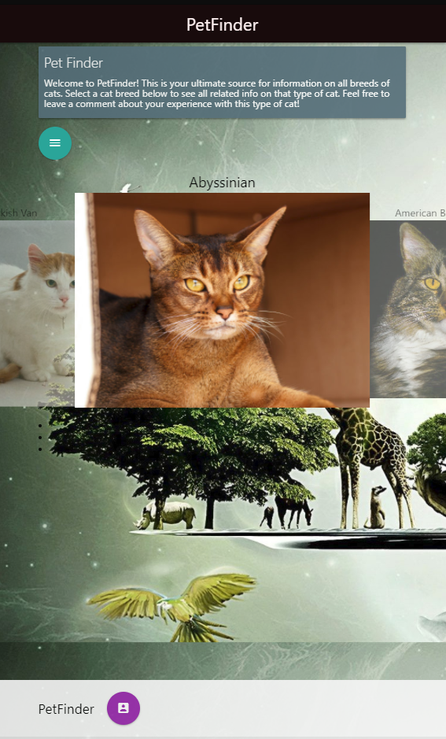
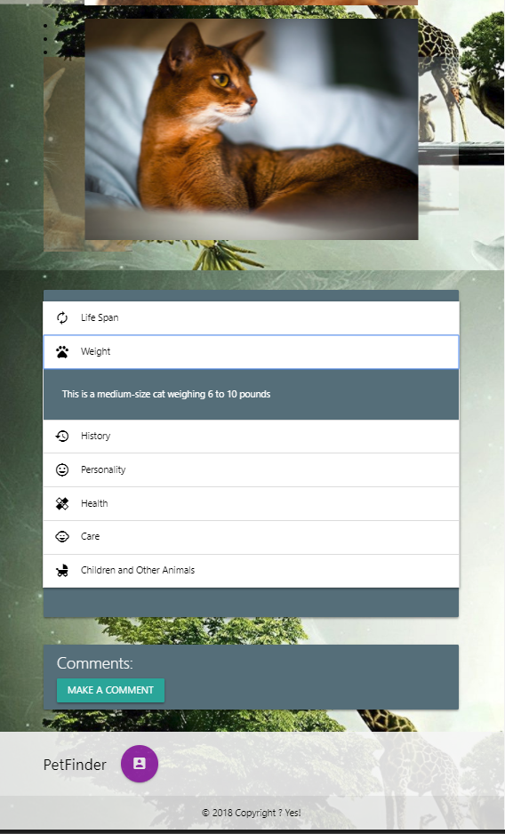
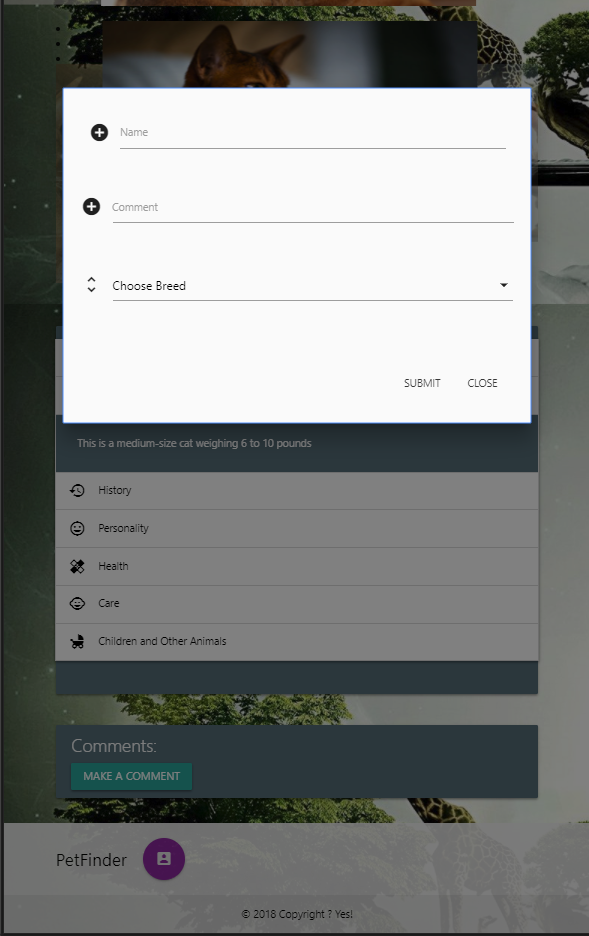

# PetFinder
> 

**Pet finder is a dynamic application that connects to a database on cats.  The database contains information on most cat breeds, including color, size, weight, behavioral attributes, feeding recommendations and other relevant details. Various links and API connections will help populate the website with relevant data.**

> Click  [PetIT](https://petfinder-mecaniser.herokuapp.com/index.html) to test app

**Purpose:** _PetFinder is intended to provide users with relevant information on any given breed of cat. Whether a user is interested in adopting a pet or learning more about their pet’s breed, this application contains applicable and practical data.  Furthermore, the application provides users the opportunity to connect to a community of owners and contribute their own data and experiences, therefore enhancing the user experience for all._

## Getting Started
____
> 
### Prerequisites
* **VSC** `installed` , **`Bash Terminal`** , `Node Package Managers` ,  `CDN`, `MySql` , `Heroku`

## You can test the app 

**`click`** [**`PetIT`**](https://petfinder-mecaniser.herokuapp.com/index.html) **` link so you can test the app.`** 

## Technologies to be used

* [NPM](https://www.npmjs.com/) |
* [_GIT BASH terminal_](https://git-scm.com/downloads) | 
* [**jQuery**](https://jquery.com/) |
* [**SEQuelize**](http://docs.sequelizejs.com/) |
* [**Node.js**](https://nodejs.org/en/) |
* [**Express Server**](https://expressjs.com/) |
* [**MySQL**](https://www.mysql.com/) |
* [**Heroku for deployment**](https://www.heroku.com/platform) |
 >`HTML`, ``CSS`` , `Moment.js`
 
           

*New technology*
*  [`Materialize`](http://materializecss.com/) |

**Future Development**
*  [**Authentication protocols (Passport)**](http://www.passportjs.org/docs/authenticate/) |
*  _More user Interaction_
*  _Dog PetFinder_ `or similar`

### App Illustration
---

---
<!--  -->

---

---

---
## Authors

> **Taddes Korris** [GitHub](https://github.com/taddes)

> **Sergio Burca** - - [*GitHub*](https://github.com/mecaniser)

>**Philopateer Mina** - -[GitHub](https://github.com/pmina)

>**Josh Dulin** - - [GitHub](https://github.com/jzdulin)

## License

This project is licensed under the MIT License - see the [LICENSE.md](LICENSE.md) file for details
